# Building Serverless Applications with CDK - Workshop

## Introduction to AWS CDK

The AWS Cloud Development Kit (AWS CDK) is an open source software development
framework to model and provision your cloud application resources using familiar
programming languages.

Provisioning cloud applications can be a challenging process that requires you
to perform manual actions, write custom scripts, maintain templates, or learn
domain-specific languages. AWS CDK uses the **familiarity and expressive power of
programming languages** for modeling your applications. It provides you with
high-level components that preconfigure cloud resources with proven defaults, so
you can build cloud applications without needing to be an expert. AWS CDK
provisions your resources in a safe, repeatable manner through AWS
CloudFormation. It also enables you to compose and share your own custom
components that incorporate your organization's requirements, helping you start
new projects faster.

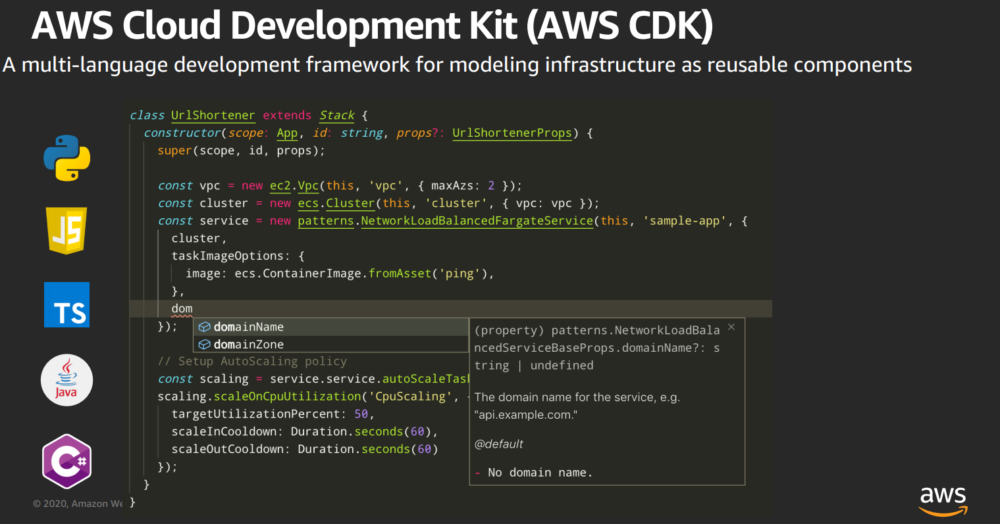

Now, how do we get started with AWS CDK? Well, easy, we just do the following:

```bash
sudo npm install -g aws-cdk
```

Okay, there is more to it - but this is what it takes to install the CDK CLI to your
workstation or wherever you wish to write your code from. Let's now focus on
setting you up to write your first bit of code.

## Setting up your Development Environment

### AWS Account

In order to complete this workshop, you’ll need access to an AWS account. Your
access needs to have sufficient permissions to create resources in IAM,
CloudFormation, API Gateway, Lambda, DynamoDB and
S3. If you currently don’t have an AWS account, you can create one
[here](https://aws.amazon.com/premiumsupport/knowledge-center/create-and-activate-aws-account)

### Setup using AWS Cloud9 (Recommended)

AWS Cloud9 is a cloud-based integrated development environment (IDE) that lets
you write, run, and debug code from any machine with just a browser. We
recommend using it to run this workshop because it already comes with the
necessary set of tools pre-installed, but the workshop is not dependent on it,
so you are free to run it from your local computer as well.

If you want to use Cloud9, follow these instructions: [Create a Cloud9
Workspace](https://docs.aws.amazon.com/cloud9/latest/user-guide/tutorial.html)

### Setup using my own computer, not using Cloud9

If you prefer to run the workshop from your local computer without using Cloud9,
make sure you install the following tools which are available for Linux, MacOS
and Windows.

- AWS CLI - We need the CLI to easily setup the AWS Credentials locally.
- NodeJS and npm - This is required for the installation of the CDK CLI.
- AWS CDK - The CLI utility that will be used throughout the workshop.

Once you have installed all requirements, you can start the workshop.

## Creating our first lambda function

Okay, time to get to some actual work - let's go ahead and create our first
serverless application with AWS CDK.

### Initializing our CDK app

Create a directory where you wish to create your application, now just make sure
to give it a proper name, as the CDK CLI command we will run will actually name
your application and it's components based off the name of the directory.

```bash
# Create our directory:
mkdir helloServerlessCDK
# Change into the newly created directory:
cd helloServerlessCDK
```

Time for some CLI magic, here we will run a command that will initialize our CDK
application and create all the necessary scaffolding that we need to work with
it:

```bash
cdk init --language=typescript
```

This should generate the file/folder structure and install the necessary Node
modules for our app. The top level directory should look something like this:

```bash
├── README.md
├── bin
├── cdk.json
├── jest.config.js
├── lib
├── node_modules
├── package-lock.json
├── package.json
├── test
└── tsconfig.json
```

Excellent, this should get us started with CDK - now, just to confirm everything
works out of the box, let's compile our TypeScript code with the following
command:

```bash
npm run build
```

You should get **no** output if eveything is succesfull!

### Serverless starts with a Lambda

Good, now that our app is initialized and that it all works (so far). Let's do
the first thing everyone does when creating serverless applications - let's
create a `HelloWorld` lambda function and see if it works!

#### CDK Part

Within your `lib/` directory you should have a single `.ts` file (in my case it
is `hello_serverless_cdk-stack.ts`) - this is where we will be writing the brunt
of our code.

Opening that file up we should have something similar to this:

```typescript
import * as cdk from '@aws-cdk/core';

export class HelloServerlessCdkStack extends cdk.Stack {
  constructor(scope: cdk.Construct, id: string, props?: cdk.StackProps) {
    super(scope, id, props);

    // The code that defines your stack goes here
  }
}
```

This code does not do anything right now, that is - it does not create any
resources - but we will fix that by creating some lambda stuff. But before we
get to any code, we need to install the required module for CDK. This will be a
common thing you need to do (if you are using CDK for TypeScript) and we will be
doing it for all resources added today.

Okay, let's install the Lambda module:

```bash
npm install @aws-cdk/aws-lambda
```

If all that is succesfull, let's go back to our
`lib/hello_serverless_cdk-stack.ts` file and make the appropropriate changes to
add the Lambda Function.

Here is how your updated file should look like:

```typescript
import * as cdk from '@aws-cdk/core';
import * as lambda from '@aws-cdk/aws-lambda';

export class HelloServerlessCdkStack extends cdk.Stack {
  constructor(scope: cdk.Construct, id: string, props?: cdk.StackProps) {
    super(scope, id, props);

    // --- greeter lambda ---
    const welcomeLambda = new lambda.Function(this, 'HelloHandler', {
        runtime: lambda.Runtime.NODEJS_10_X,
        code: lambda.Code.fromAsset('lambda'),
        handler: 'hello.handler'
    });
  }
}
```

Simple right? Well let me explain some parts of this code so it makes a bit more
sense to everyone.

First we need to import our newly installed `@aws-cdk/aws-lamba` module, and we
import it as `lambda` so later on we can reference it to create the function:

```typescript
import * as lambda from '@aws-cdk/aws-lambda';
```

Then we actually create the Lambda functon, and assing it to a constant called
`welcomeLambda`.

```typescript
const welcomeLambda = new lambda.Function(this, 'HelloHandler', {
    runtime: lambda.Runtime.NODEJS_10_X,
    code: lambda.Code.fromAsset('lambda'),
    handler: 'hello.handler'
});
```

There are a few things we need to note here regarding this piece of code:

- we defined the runtime of our Lambda function as NodeJS 10.x in the `runtime`
  property
- The code of the Lambda function is read off disk, off from the `lambda`
  directory in the root of our CDK app.
- The name of our file, in this case, will have to be `hello.js` as that is what
  handler we have defined in the handler property.

#### The Lambda function itself

A lambda function would not be a function with out the appropropriate code. So
let's create that now.

At the root of your CDK app, create a directory named `lambda` and within it
create a file named `hello.js` with the following content:

```javascript
exports.handler = async function(event) {
  console.log("request:", JSON.stringify(event, undefined, 2));
  return {
    statusCode: 200,
    headers: { "Content-Type": "text/plain" },
    body: `Hello and Welcome to our Serverless Application!\n`
  };
};
```

Excellent, this should be it - make sure to save your file, and we should be
ready to go.

#### Create our first Lambda with CDK

Now, let's use the power of AWS CDK to generate our Serverless infrastructure.
Go back to the root of your CDK application (on your Terminal), and compile your
TypeScript to JavaScript:

```bash
npm run build
```

If you did everything okay, there should be no output, at least no error output.
If that is the case, let's deploy our application to AWS.

```bash
cdk deploy
```

If all is okay, you should be prompted to confirm some IAM changes, as CDK will
actually cretea some IAM resources for our Lambda function, make sure to confirm
these if you are happy with them:

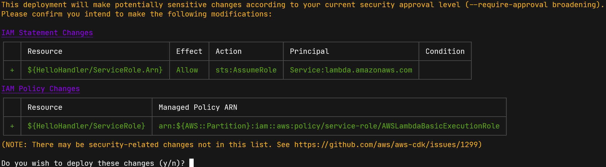

Excellent, if all went okay you should be prompted with a nice green check mark
:white_check_mark: - meaning success! :heart_eyes:
Also as CDK is creating a CloudFormation template, you should have the
CloudFormation stack ARN to reference if you wish.

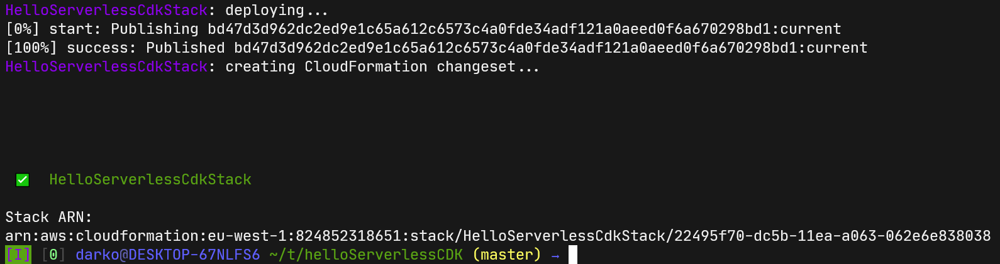

We can also confirm that this is all deployed by heading over to our AWS Web
Console, and going into Lambda to see if our new function has showed up:

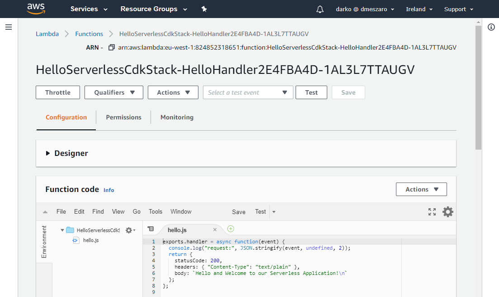

Yay - we are good to go! But wait, how do we interact with this lambda
function? Doesn't every `hello world` example need to give a Hello to the World?
:thinking: Let's fix that - let's add some additional functionality to our
Serverless application to make it work.

### Serve my APIs

Okay, to make our Lambda function actually do something visible, we need to
create an interface to it. The best way to approach this is to use our Lambda
function as a part of a REST API - and here is where our friend [AWS API
Gateway](https://aws.amazon.com/api-gateway/) comes into play!

To create and integrate our API gateway, we need to (as always) install a node
module to our CDK app:

```bash
npm install @aws-cdk/aws-apigateway
```

Then let's use it in our `hello_serverless_cdk-stack.ts` stack, by adding it in
a very similar way as we did our Lambda function:

```typescript
import * as cdk from '@aws-cdk/core';
import * as lambda from '@aws-cdk/aws-lambda';
import * as apigw from '@aws-cdk/aws-apigateway';

export class HelloServerlessCdkStack extends cdk.Stack {
  constructor(scope: cdk.Construct, id: string, props?: cdk.StackProps) {
    super(scope, id, props);

    // The code that defines your stack goes here
    // --- greeter lambda ---
    const welcomeLambda = new lambda.Function(this, 'HelloHandler', {
        runtime: lambda.Runtime.NODEJS_10_X,
        code: lambda.Code.fromAsset('lambda'),
        handler: 'hello.handler'
    });
    // --- api gateway ---
    const api = new apigw.RestApi(this, 'helloApi');
    // --- greeter lambda integration ---
    const apiHelloInteg = new apigw.LambdaIntegration(welcomeLambda);
    const apiHello = api.root.addResource('hello');
    apiHello.addMethod('GET', apiHelloInteg);
  }
}
```

Similar to before, we have imported our newly installed module as `apigw` and we
will be using it down the line to create our API Gateway.

Now, let's look at the code creating our API Gateway:

```typescript
const api = new apigw.RestApi(this, 'helloApi');
```

Very simple, right? Creating a new API Gateway `RestApi` to a constant called
`api`. And giving it a name `helloApi`. Now this is needed, but it actually does
not do anything with our Lambda, for that to work - we need to create a Lambda
integration with the API Gateway.

Here is how that is done:

```typescript
const apiHelloInteg = new apigw.LambdaIntegration(welcomeLambda);
const apiHello = api.root.addResource('hello');
apiHello.addMethod('GET', apiHelloInteg);
```

So, the first line here creates a new Lambda + API Gateway integration, and we
tie it to the `welcomeLambda` function we created before. Then we followup by
creating a `hello` resource to our API Gateway - in essence just adding a path
to our API GW URL (eg. `$APIGW_URL/prod/hello`) that will be used for our
greeter lambda function - this will be the URL we trigger to invoke the lambda
Function. Lastly we are adding the `GET` method to that resource.

Now, it's time to save our file and see if this change works.

As before, let's compile and deploy our CDK application:

```bash
npm run build
cdk deploy
```

Similar to as before, you will be prompted to confirm some IAM changes - as by
adding the API Gateway and Lambda integrations, some of the permissions need to
be changed/added. Confirm them after you have reviewed them.

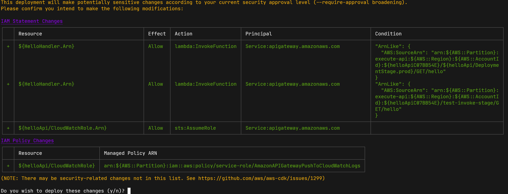

Now, if all goes good - you should get that lovely :white_check_mark: again, but
now there is some additional information - an URL we can use :heart_eyes:

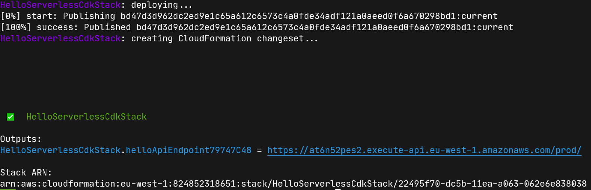

We can actually open this URL up in our favorite browser (or API developent
tool) to see how it works. **Remmember to add the `hello` to the end of the
URL**

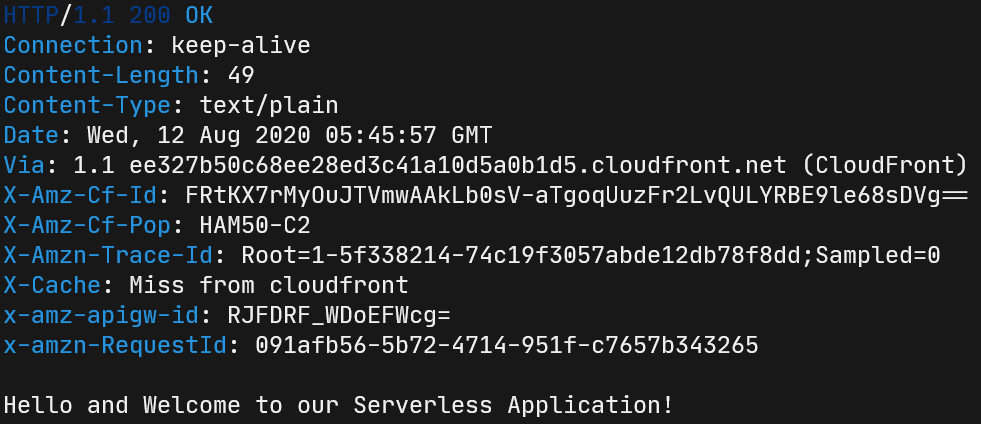

Yay! :rocket:

And that would be our first simple, `hello_world` example - but let's expand on
this. Let's see what else can we get away with in our Serverless Application.

## Databases and more

Okay - we made it so far - let's add more functionality to our Serverless
Application, by adding a data layer to it. In most use cases, people opt in to
use [DynamoDB](https://aws.amazon.com/dynamodb/) - a NoSQL solution from AWS as
their database of choice for Serverless applications. So, let's create a
Database, and add some more lambda functions to interact with the data.

### DynamoDB

Time to create our first DynamoDB table with AWS CDK - as before - we need to
install the required module for this to work:

```bash
npm install @aws-cdk/aws-dynamodb
```

Hopefully this has executed succesfully and we can go ahead and add some code to
our stack. Let's go and edit our `hello_serverless_cdk-stack.ts` file and add
our module and our DynamoDB table to it.

```typescript
import * as cdk from '@aws-cdk/core';
import * as lambda from '@aws-cdk/aws-lambda';
import * as apigw from '@aws-cdk/aws-apigateway';
import * as dynamodb from '@aws-cdk/aws-dynamodb';

export class HelloServerlessCdkStack extends cdk.Stack {
  constructor(scope: cdk.Construct, id: string, props?: cdk.StackProps) {
    super(scope, id, props);

    // The code that defines your stack goes here
    // --- dynamodb table ---
    const table = new dynamodb.Table(this, 'people', {
        partitionKey: { name: 'name', type: dynamodb.AttributeType.STRING},
        tableName: 'usersTable',
    });
    // --- greeter lambda ---
    const welcomeLambda = new lambda.Function(this, 'HelloHandler', {
        runtime: lambda.Runtime.NODEJS_10_X,
        code: lambda.Code.fromAsset('lambda'),
        handler: 'hello.handler'
    });
    // --- api gateway ---
    const api = new apigw.RestApi(this, 'helloApi');
    // --- greeter lambda integration ---
    const apiHelloInteg = new apigw.LambdaIntegration(welcomeLambda);
    const apiHello = api.root.addResource('hello');
    apiHello.addMethod('GET', apiHelloInteg);
  }
}
```

Let's see what did we add here :thinking:

```typescript
// --- dynamodb table ---
const table = new dynamodb.Table(this, 'people', {
    partitionKey: { name: 'name', type: dynamodb.AttributeType.STRING},
    tableName: 'usersTable',
});
```

This looks straightforward enough - we have created a DynamoDB table called
`usersTable` with a partition key called `name` and type of string. This should
be all we need right now to created a table.

:point_up: **DO NOTE: Make sure you do not have a table named `usersTable` in
this region already** :point_up:

### Read/Write Lambda

Now, let's add a few Lambda scripts that will interact with data - the goal of
these cripts will be to created and read "users" - arbitrary data written into
the DynamoDB table for the sake of this workshop. For this use case we will
create two additional Lamba scripts, one that reads and the one that writes to
the DynamoDB table.

We can follow the same example as above when creating functions, but our stack
should look something like this:

```typescript
import * as cdk from '@aws-cdk/core';
import * as lambda from '@aws-cdk/aws-lambda';
import * as apigw from '@aws-cdk/aws-apigateway';
import * as dynamodb from '@aws-cdk/aws-dynamodb';

export class HelloServerlessCdkStack extends cdk.Stack {
  constructor(scope: cdk.Construct, id: string, props?: cdk.StackProps) {
    super(scope, id, props);

    // The code that defines your stack goes here
    // --- dynamodb table ---
    const table = new dynamodb.Table(this, 'people', {
        partitionKey: { name: 'name', type: dynamodb.AttributeType.STRING},
        tableName: 'usersTable',
    });
    // --- greeter lambda ---
    const welcomeLambda = new lambda.Function(this, 'HelloHandler', {
        runtime: lambda.Runtime.NODEJS_10_X,
        code: lambda.Code.fromAsset('lambda'),
        handler: 'hello.handler'
    });
    // --- api gateway ---
    const api = new apigw.RestApi(this, 'helloApi');
    // --- greeter lambda integration ---
    const apiHelloInteg = new apigw.LambdaIntegration(welcomeLambda);
    const apiHello = api.root.addResource('hello');
    apiHello.addMethod('GET', apiHelloInteg);

    // --- user input lambda ---
    const createLambda = new lambda.Function(this, 'CreateHandler', {
        runtime: lambda.Runtime.NODEJS_10_X,
        code: lambda.Code.fromAsset('lambda'),
        environment: { 'TABLE_NAME': 'usersTable' },
        handler: 'createUser.handler'
    });

    // --- user input lambda integration ---
    const apiCreateInteg = new apigw.LambdaIntegration(createLambda);
    const apiCreate = api.root.addResource('create');
    apiCreate.addMethod('POST', apiCreateInteg);

    // --- user read lambda ---
    const readLambda = new lambda.Function(this, 'ReadHandler', {
        runtime: lambda.Runtime.NODEJS_10_X,
        code: lambda.Code.fromAsset('lambda'),
        environment: { 'TABLE_NAME': 'usersTable' },
        handler: 'readUser.handler'
    });

    // --- user read lambda integration ---
    const apiReadInteg = new apigw.LambdaIntegration(readLambda);
    const apiRead = api.root.addResource('read');
    apiRead.addMethod('GET', apiReadInteg);

  }
}
```

Pretty simple - right? The only difference we have in these Lambdas compared to
the other ones, is that we are defining some Environment Variables that will be
used by the Lambda code. The line: `environment: { 'TABLE_NAME': 'usersTable'
}` sets the Environment Variable 'TABLE_NAME' to 'usersTable' giving us a way to
tell a Lambda function which table to use.

So, right now we have the following here:

- Our `HelloWorld` Lambda Function and API Gateway
- A DynamoDB Table that will contain our users
- A Lambda Function to read stuff our of the Table
- The writer Lambda function, that will - you guessed it - write stuff to the
  Table.

But we seem to be missing something :thinking:

**EXACTLY!** We are missing permissions - that is we have allowed our Lambda
functions to interact with our DynamoDB table. That will require us to create a
bunch of IAM roles and Policies in order to achieve this:

```bash
...
```

Nah, I'm kidding - this is CDK, it does stuff for us so we do not have to! Just
add the following lines to your stack:

```typescript
// --- table permissions ---
table.grantReadData(readLambda);
table.grantReadWriteData(createLambda);
```

Finally let's just add some lambda code to our `lambda` directory that will be
used in the above created lambdas.

`lambda/readUser.js`

```javascript
const AWS = require('aws-sdk');

var TableName = process.env.TABLE_NAME
var region = process.env.AWS_REGION
AWS.config.update({region: region})

const dynamo = new AWS.DynamoDB.DocumentClient();

exports.handler = (event, context, callback) => {
    const Key = {};
    Key['name'] = event.queryStringParameters.name;

    dynamo.get({TableName, Key}, function(err, data) {
        if (err) {
            callback(err, null);
        } else {
            var response = {
                statusCode: 200,
                headers: {
                    'Content-Type': 'application/json',
                    'Access-Control-Allow-Methods': 'GET,POST,OPTIONS'
                },
                body: JSON.stringify(data.Item),
                isBase64Encoded: false
            };
            callback(null, response);
        }
    });
};
```

`lambda/createUser.js`

```javascript
const AWS = require('aws-sdk');

var TableName = process.env.TABLE_NAME
var region = process.env.AWS_REGION
AWS.config.update({region: region})

const dynamo = new AWS.DynamoDB.DocumentClient();

exports.handler = (event, context, callback) => {

    const Item = {};
    Item['name'] = event.queryStringParameters.name;
    Item['location'] = event.queryStringParameters.location;
    Item['age'] = event.queryStringParameters.age;
    
    dynamo.put({TableName, Item}, function (err, data) {
        if (err) {
            console.log('error', err);
            callback(err, null);
        } else {
            var response = {
                statusCode: 200,
                headers: {
                    'Content-Type': 'application/json',
                    'Access-Control-Allow-Methods': 'GET,POST,OPTIONS',
                    'Access-Control-Allow-Credentials': 'true'
                },
                isBase64Encoded: false
            };
            console.log('success: returned ${data.Item}');
            callback(null, response);
        }
    });
};
```

Perfect - now that this is all saved (make sure it is). Let's compile and deploy
our CDK application.

```bash
npm run build
cdk deploy
```

Same as before, you will be prompted for a whole bunch of IAM changes/creations,
make sure to review those and confirm them. If all goes good - you should (as
always) get that lovely :white_check_mark: and an API Gateway URL. Make sure to
copy the URL somewhere.

### Testing our Lambdas

Okay, let's have a look if our Serverless API application works as it should.
First thing we need to do is run the `create` API call to create a user in our
Database, and then we will run the `read` API call to read that information.

To create our user in the table, we need to run a POST API call to our API
Gateway endpoint, and pass it also some data - here is an example how can you do
it using the `curl` command, but you should be able to do it in any other way
you find fit.

```bash
curl -v -X POST \
   'https://UUID.execute-api.eu-west-1.amazonaws.com/prod/create?name=darko&location=berlin&age=32'
```

This should output a whole lot of stuff, but if you have no errors in your setup
it should look something like this, as we are not returning any information
back:

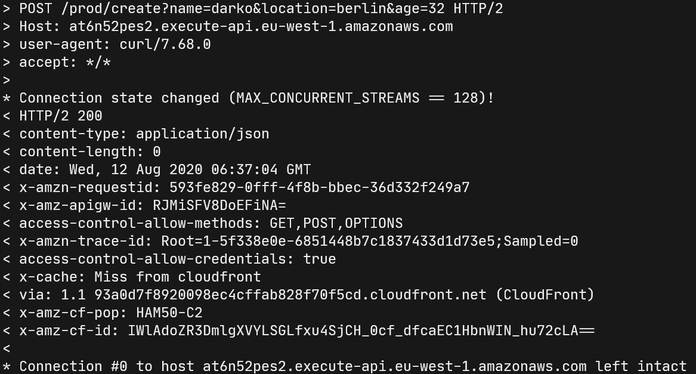

We can actually check the DynamoDB Table in the web console, to see if this
user/row is created:

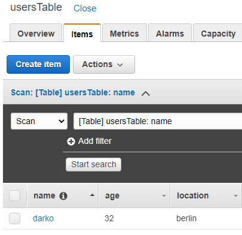

Perfect - let's try to query this user via the API call to see if it all works.
As before I will be using `curl` for this - but anything else will also do. The
main part of our GET request is the name - as that is our primary key. I know it
is not perfect, as there may be more people named 'Darko' here - but we can
modify that in the future.

```bash
curl -v -X GET \
   'https://UUIDj.execute-api.eu-west-1.amazonaws.com/prod/read?name=darko'
```

If all is good, like before - we should get a whole bunch of output - but the
main part should be at the bottom:

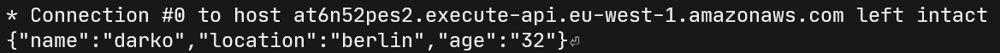

As said before ... YAY! It works :rocket:

We have succesfully created a rather simple Serverless Application with AWS CDK,
so right now we have three Lambda Functions, an API Gateway and a DynamoDB
table, and it all does it's job. What ever that is. But we can do one better,
let's modify our CDK code so we can introduce multiple environments to our
application.

`PROD` / `STAGE` anyone? :thinking:

## Don't `DEV` in `PROD`

As any good workload out there we need to be able to split up our Production
environment from our Staging or Development ones. With CDK that can be done
realtively simply with the use of multiple Stacks.

One thing I need to explain when it comes to CDK is the concept of Apps, Stacks
and Resources:

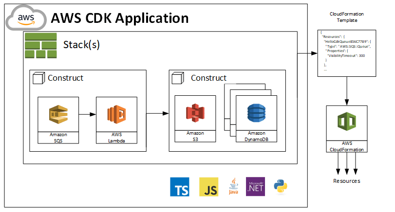

Looking at this, in CDK we have Apps, Stacks and Resources. Resources are actual
AWS resources that are being created by CDK, Stacks are logical groupings of
those resources, and Apps are logical groupings of Stacks and Resources. Simply put:

- You can have multiple **Resources** per **Stack**
- You can have multiple **Stacks** per **App**

With that out of the way, what we will be doing now is giving our CDK app the
ability to launch multiple Stacks - namely our `PROD` and `STAGING` stack. Why
you may ask? Well we may want to apply different parameters/settings to our
resources in PROD compared to doing it in STAGING.

### Create multiple stacks

:point_up: Before we go here let's just cleanup our existing stack by destroying it
:smiling_imp: Just run the following command and it will remove most resources:

```bash
cdk destroy
```

Due to data retention policies - the DynamoDB table will have to be deleted
manually - so just pop over into the DynamoDB web console and remove the table
if you wish to use the same table name in the future.

Okay back to the main show.

So this is the first time we will be having a face to face with our CDK bin
file. Located in the `bin/` directory and (in my case) named
`hello_serverless_cdk.ts` This file is used, in our case, to create our stack
and by default here are its contents (we have not changed this throughout this
workshop - yet):

```typescript
#!/usr/bin/env node
import 'source-map-support/register';
import * as cdk from '@aws-cdk/core';
import { HelloServerlessCdkStack } from '../lib/hello_serverless_cdk-stack';

const app = new cdk.App();
new HelloServerlessCdkStack(app, 'HelloServerlessCdkStack');
```

This is the file where we can define some additional parameters and properties
for multiple stacks, lets do that right now. Add the following changes and
  ensure that your `hello_serverless_cdk.ts` file looks like this:

```typescript
#!/usr/bin/env node
import 'source-map-support/register';
import * as cdk from '@aws-cdk/core';
import { HelloServerlessCdkStack } from '../lib/hello_serverless_cdk-stack';

const app = new cdk.App();
new HelloServerlessCdkStack(app, 'prod',
  {
    prod: true,
    env: {
      region: 'eu-west-1'
    }
});
new HelloServerlessCdkStack(app, 'staging',
  {
    prod: false,
    env: {
      region: 'eu-west-1'
    }
});
```

We have added a few lines of code here, namely we've given the ability to our
CDK app to create multiple Stacks with some different parameters. As you can see
here, we are simply passing the parameter `prod` (to be either `true` or
`false`) to the stack. On top of that, we are also defining the region - if we
would like to launch staging in a different region (for some reason). 

Okay, but now we need to implement some logic into our stacks to handle the
`prod` being `true` or `false`. Let's go back to our trusty
`hello_serverless_cdk-stack.ts` stack file, and add the following lines just
below our imports: 

```typescript
// Properties defined where we determine if this is a prod stack or not
interface EnvStackProps extends cdk.StackProps {
  prod: boolean;
}
```

This exposes the properties interface of our stack - and just to enable this in
our stack construct we need to use these properties there, so make sure to
change our `constructor` line from this:

```typescript
constructor(scope: cdk.Construct, id: string, props?: cdk.StackProps) { // ...
```

To this:

```typescript
constructor(scope: cdk.Construct, id: string, props?: EnvStackProps) { // ...
```

Okay good - we have exposed the new properties to our stack - let's use it now
in some code. Add the following code just above the first thing we create with
CDK (dynamodb table):

```typescript
// Defining the prod or no prod
if (props && props.prod) { // prod
  var dynamoDbReadWrite = 200;
  var apiGatewayName = 'PROD_cdk_api';
  var tableName = 'PROD_cdk_users';
  var lambdaVars = { 'TABLE_NAME': tableName};
  var concurrency = 100;
} else { // not prod
  var tableName = 'STAGING_cdk_users';
  var apiGatewayName = 'STAGING_cdk_api';
  var dynamoDbReadWrite = 5;
  var lambdaVars = { 'TABLE_NAME': tableName};
  var concurrency = 5;
}
```

As you can see here, we are setting some variables values based on the `prod`
property being set or not. Later on in the code we can use these variables on
our resources. Actually let's set those now - I will not go over each detail
here, but you are able to see all the changes in the updated stack file right
here:

```typescript
import * as cdk from '@aws-cdk/core';
import * as lambda from '@aws-cdk/aws-lambda';
import * as apigw from '@aws-cdk/aws-apigateway';
import * as dynamodb from '@aws-cdk/aws-dynamodb';

// Properties defined where we determine if this is a prod stack or not
interface EnvStackProps extends cdk.StackProps {
  prod: boolean;
}

export class HelloServerlessCdkStack extends cdk.Stack {
  constructor(scope: cdk.Construct, id: string, props?: EnvStackProps) {
    super(scope, id, props);

    // The code that defines your stack goes here
    // Defining the prod or no prod
    if (props && props.prod) { // prod
      var dynamoDbReadWrite = 200;
      var apiGatewayName = 'PROD_cdk_api';
      var tableName = 'PROD_cdk_users';
      var lambdaVars = { 'TABLE_NAME': tableName};
      var concurrency = 100;
    } else { // not prod
      var tableName = 'STAGING_cdk_users';
      var apiGatewayName = 'STAGING_cdk_api';
      var dynamoDbReadWrite = 5;
      var lambdaVars = { 'TABLE_NAME': tableName};
      var concurrency = 5;
    }
    // --- dynamodb table ---
    const table = new dynamodb.Table(this, 'people', {
        partitionKey: { name: 'name', type: dynamodb.AttributeType.STRING},
        tableName: tableName,
        readCapacity: dynamoDbReadWrite,
        billingMode: dynamodb.BillingMode.PROVISIONED
    });
    // --- greeter lambda ---
    const welcomeLambda = new lambda.Function(this, 'HelloHandler', {
        runtime: lambda.Runtime.NODEJS_10_X,
        code: lambda.Code.fromAsset('lambda'),
        reservedConcurrentExecutions: concurrency,
        handler: 'hello.handler'
    });
    // --- api gateway ---
    const api = new apigw.RestApi(this, apiGatewayName);
    // --- greeter lambda integration ---
    const apiHelloInteg = new apigw.LambdaIntegration(welcomeLambda);
    const apiHello = api.root.addResource('hello');
    apiHello.addMethod('GET', apiHelloInteg);

    // --- user input lambda ---
    const createLambda = new lambda.Function(this, 'CreateHandler', {
        runtime: lambda.Runtime.NODEJS_10_X,
        code: lambda.Code.fromAsset('lambda'),
        reservedConcurrentExecutions: concurrency,
        environment: lambdaVars,
        handler: 'createUser.handler'
    });

    // --- user input lambda integration ---
    const apiCreateInteg = new apigw.LambdaIntegration(createLambda);
    const apiCreate = api.root.addResource('create');
    apiCreate.addMethod('POST', apiCreateInteg);

    // --- user read lambda ---
    const readLambda = new lambda.Function(this, 'ReadHandler', {
        runtime: lambda.Runtime.NODEJS_10_X,
        code: lambda.Code.fromAsset('lambda'),
        reservedConcurrentExecutions: concurrency,
        environment: lambdaVars,
        handler: 'readUser.handler'
    });

    // --- user read lambda integration ---
    const apiReadInteg = new apigw.LambdaIntegration(readLambda);
    const apiRead = api.root.addResource('read');
    apiRead.addMethod('GET', apiReadInteg);

    // --- table permissions ---
    table.grantReadData(readLambda);
    table.grantReadWriteData(createLambda);
  }
}
```

Thats a bunch of code now - but this gives some changes to our infrastructure
depending on what environment it is running in.

Okay - time do do one more deploy here, but it's a bit different now - we get to
pick which environment to launch! Let's deploy staging now  :rocket:

```bash
npm run build
cdk deploy staging
```

:boom: It works (hopefully)!

Again, like before we can do the same things as with the other stack launched,
just this time we can do it twice with some different settings depending if it
is a `PROD` or a `STAGING` stack.

## Cleanup

At the end of everyworkshop, you may wish to cleanup the stuff you have created
so you do not incurr additional costs. Well it is simple when it comes to CDK -
just make sure to run these lovely commands:

```bash
cdk destroy staging
cdk destroy prod
```

If you have created these environment, they should now be gone (apart from the
DynamoDB table - so make sure to do that too :point_up: ).
